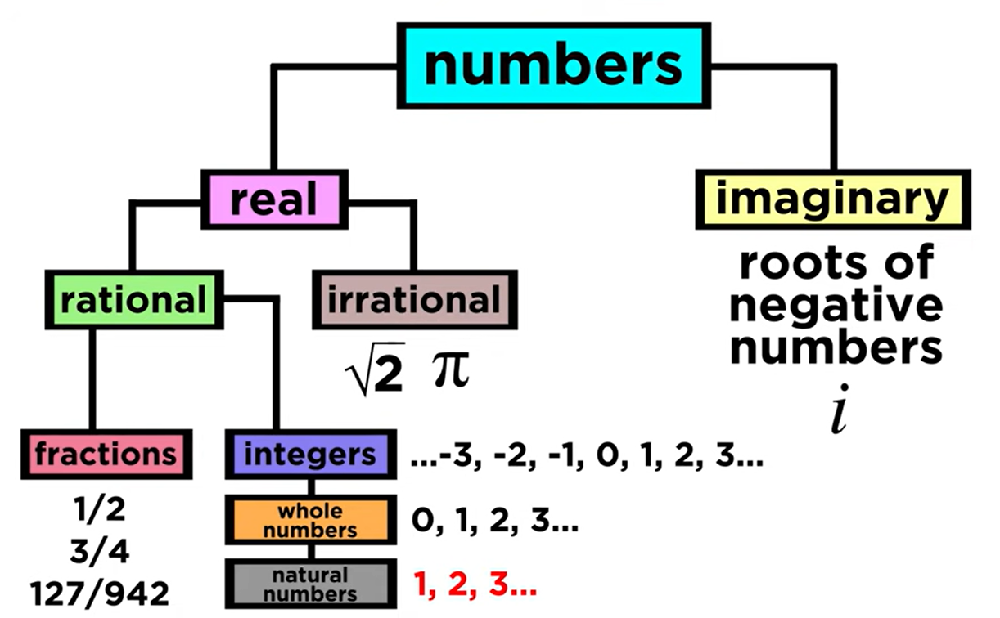
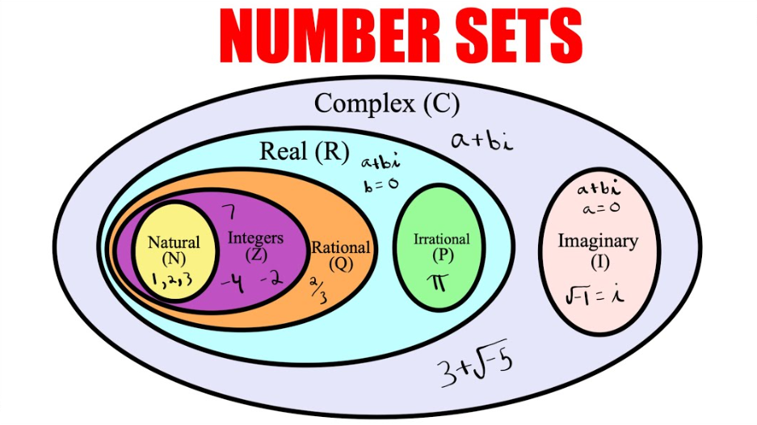

# Number Sets

- Integers: $\mathbb{Z}$
- Natural: $\mathbb{N}$
- Whole: $\mathbb{W}$
- Real: $\mathbb{R}$
- Rational: $\mathbb{Q}$
- Irrational: $\mathbb{I}$
- Imaginary: NA (not available)
- Complex: $\mathbb{C}$

## References

* [What are the Types of Numbers?](https://youtu.be/QUGmwPwtbpg?si=I4BgQn2cM-tnQ-dg)